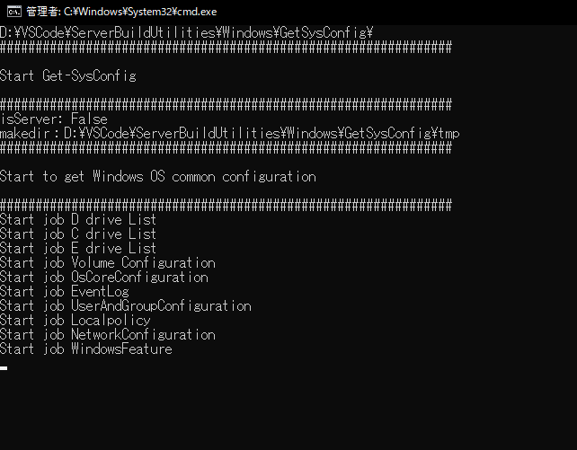
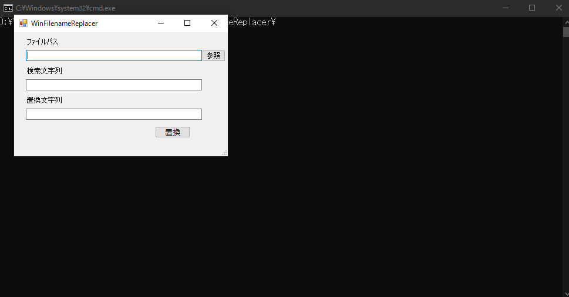

# ServerBuildUtilities
A collection of tools useful for server construction

# Overview
This repository is a collection of tools to help you build a server.  
Each tool is designed to work independently.  
For details, refer to the README of each tool.

# Demo
  

# Usage
Basically it can be used without installation.  
Read the README for each tool for details.

# Requirement
The README of each tool describes the OS for which operation is being verified.  

# Install
Simply download the zip file and unzip it to use it.

# developement
use Git-Flow

# license
Copyright (c) 2020 tokku5552  
This software is released under the MIT License.  
https://opensource.org/licenses/mit-license.php
